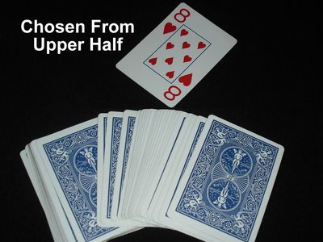
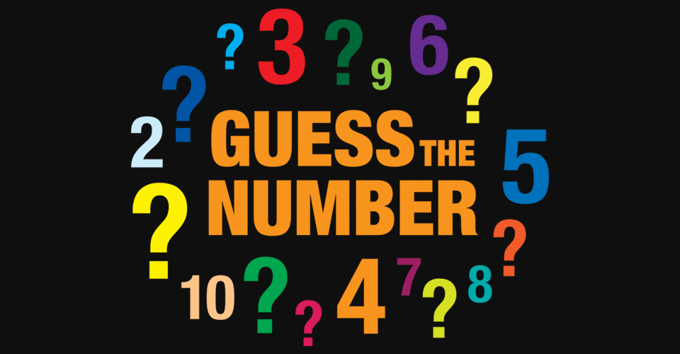

# Assignment - Guessing Game

## Implementation Logistics

- You may use whatever operating system, IDE, or tools for completing this lab/assignment.
	- However, my instructions will usually be using the command-line, and that is what I will most easily be able to assist you with.
- In the future there may be restrictions, so please review the logistics each time.

**For this Lab/Assignment**: You will be working on your own laptop/desktop machine.


# Resources to help

- C++ Related
	- A Standard Tutorial: http://www.cplusplus.com/doc/
	- cpp reference: https://en.cppreference.com/w/
		- Full reference of everything available in the language and standard libraries
	- The ISO Standard for the language: https://isocpp.org
		- Typically the latest and greatest information will always be here.

# Description



I was always impressed by those folks at the amusement parks and country fairs who could perform magic tricks. I even remember once getting a booklet where if you asked someone enough questions in a row, you could guess their date of birth. It was a sort of neat magic trick, but back then (when I was about five years old) I did not realize I was being tricked by not a circus act, but instead by a programmer! 

Let’s figure out how to write a similar program to guess a randomly generated number by the computer.

## Compiling and running this assignment

For this assignemnt, you may use the [clang++](https://clang.llvm.org/) or [g++](https://www.gnu.org/software/gcc/) compiler (Or even MSVC). clang++ and g++ are industry standard compilers for compiling C++ programs (in addition to many other programming languages). Sometimes trying different compilers will given you more informative or helpful error messages--either one is perfectly fine for this course!

Here is how you will compile your code on the terminal.

`clang++ main.cpp -o prog`

or

`g++ main.cpp -o prog`

Both achieve the same thing. 

* First the compiler is specified (g++ or clang++).
* Then a 'space' follows, and then the '.cpp' file we want to compile.
* `-o` is a flag abbreviated for output. Items that begin with *dash marks* in general are compiler flags.
  * In this case the 'output' file we will generate(if there are no errors) will be called `prog`
  * Note: This **prog** file is a binary file that we can execute. This is different than [main.cpp](./main.cpp) which has the .cpp extension, and is a text file representing our source code.
  
Finally, to execute your program, you will type in: `./prog` in the terminal.

## Overall workflow

So the overall workflow for completing this assignment will likely be something like:

1. Open up the VIM text editor with tmux (or otherwise your editor of choice)
2. Write or change a very small number of lines of code (sometimes just one change!)
3. Save the text file after making your change
4. Recompile your program
5. Run your program, and see if it meets your assumptions.
6. Go back to step 2 and repeat

This is the full "Edit, Save, compile, and run" cycle. Remember, C++ is a compiled language, so we have to recompile a new binary file every time we want to test our program.

# Task 1 - Guessing Game in C++



It is now time to implement the guessing game in [main.cpp](./main.cpp). The requirements of the program are as follows:

- You will play the guessing game a total of 5 times in a row.
- Each round a new number must be randomly generated generate a number from 1 to 10.
	- See an example at: https://en.cppreference.com/w/cpp/numeric/random/rand 
- The user will guess the number.
	- See an example of reading in a value: https://en.cppreference.com/w/cpp/io/cin
  - If the number is correct, then the game ends.
  - If the number is wrong, then a hint should be provided whether the correct number is higher or lower.
- Each time a user guesses, you should increment how many guesses the user has made for the round.
- When the user guesses the correct answer, output that they have finished.
  - Then either start a new game, or if 5 rounds have been played then output the summary of how many guesses the user made over 5 games.
- You should use either a [std::array](http://www.cplusplus.com/reference/array/array/) or a [std::vector](http://www.cplusplus.com/reference/vector/vector/) data structure to store the number of guesses made each round.

### Helpful hints

1. If you would like, while you are 'debugging' your program, you can print out (using std::cout) the correct answer to shorten iteration time. 
	- Be sure not to do this for your final version however!
2. There is a handy function called `std::rand` found in the `#include <cstdlib>` for generating random numbers. You will want to think about how to use it.
	- (Note: C programmers are use to finding this library in `#include <stdlib.h>`. The C++ version of C libraries are prefixed with a 'c' in front of them, and require no .h at the end when importing.)
4. Additionally, you will want to think about how to get user input. For this assignment, you should only need to read in a single numerical value (i.e. using std::cin).

### Sample of Correct output 

Below is a sample of a correct iteration of the game. You can make your display 'prettier' if you like, but at a minimum it should look similar to the output below. 

```
-bash-4.2$ g++ main.cpp -o prog
-bash-4.2$ ./prog
==========================
CPU Says: Pick a number 1-10
==========================
Make a guess:1
No guess higher!
Make a guess:2
No guess higher!
Make a guess:3
No guess higher!
Make a guess:4
No guess higher!
Make a guess:5
No guess higher!
Make a guess:6
No guess higher!
Make a guess:7
No guess higher!
Make a guess:8
You got it!
==========================
CPU Says: Pick a number 1-10
==========================
Make a guess:5
No guess higher!
Make a guess:7
No guess lower!
Make a guess:6
You got it!
==========================
CPU Says: Pick a number 1-10
==========================
Make a guess:5
No guess higher!
Make a guess:8
You got it!
==========================
CPU Says: Pick a number 1-10
==========================
Make a guess:5
No guess higher!
Make a guess:8
No guess higher!
Make a guess:9
You got it!
==========================
CPU Says: Pick a number 1-10
==========================
Make a guess:5
No guess lower!
Make a guess:3
No guess lower!
Make a guess:1
No guess higher!
Make a guess:2
You got it!
=================================================
|Here are the results of your guessing abilities|
=================================================
Game 0 took you 8 guesses
Game 1 took you 3 guesses
Game 2 took you 2 guesses
Game 3 took you 3 guesses
Game 4 took you 4 guesses
```

(Game 0? Yes...I do often count from 0--remember the C++ langauge is 0-indexed!)

# How we will compile your program

* `g++ main.cpp -o prog`

# How we will run your program

* Run with: `./prog`


# Deliverables

* An implementation of a guessing game in [main.cpp](./main.cpp)

# F.A.Q. (Instructor Anticipated Questions)

1. Q: Can I use other C++ data structures and features I know about to make things easier?
	- A: Sure.
2. Q: Can I use a raw array?
	- A: Sure, but I'd really like you to explore std::array and std::vector to see what they offer. They are safer data structures!
3. Q: Should I be using feature X, should I be using good programming practice Y, should I do object-oriented thing Z?
	- A: For this first assignment, I just want you working in C++ and getting use to compiling C++ code. We really won't be grading for much style, unless you do something really wild (like add 500 spaces between each line, or NaMeThiNGSreallY_BizARely)

# Found a bug?

If you found a mistake (big or small, including spelling mistakes) in this lab, kindly send me an e-mail. It is not seen as nitpicky, but appreciated! (Or rather, future generations of students will appreciate it!)

- Fun fact: The famous computer scientist Donald Knuth would pay folks one $2.56 for errors in his published works. [[source](https://en.wikipedia.org/wiki/Knuth_reward_check)]
- Unfortunately, there is no monetary reward in this course :)
